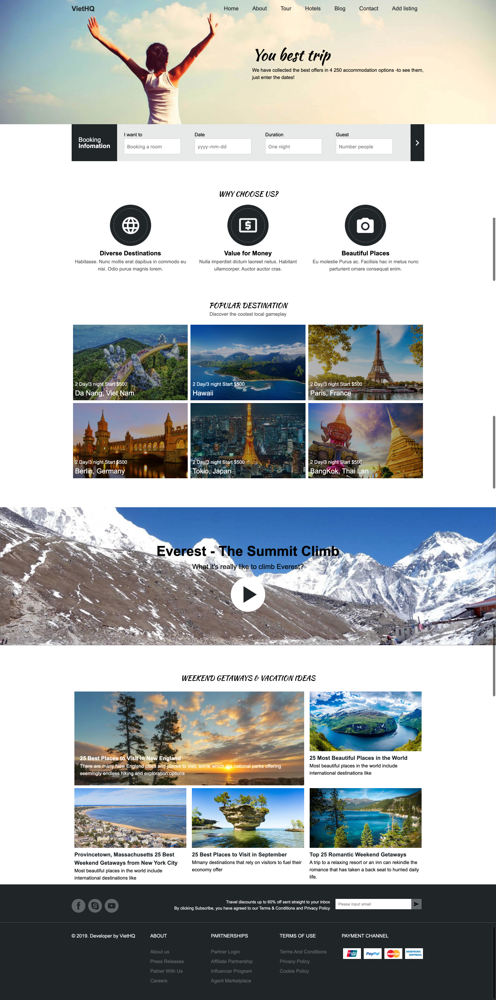

# Template webiste travel
## Intructuction

Flat and responsive website template, designed and coded by [VietHQ](https://github.com/viethq-dn).

## Requirements

- [Node.js](http://nodejs.org/)
- Build sytem: [Webpack](https://webpack.js.org)
- Optionally:
  * [Editorconfig](http://editorconfig.org/)

#### Editorconfig

This project has an .editorconfig file at the root. It describes indent style, trailing whitespaces etc. See more details [here](http://editorconfig.org/)

## How to start

Before start you need to have installed _npm_.

**A few simple steps to start:**
* Install dependencies from `package.json` by running: `npm install`.
* `npm start` 
* open url [localhost:3001](http://localhost:3001)

#### Build

Build task.
Gulp: `npm run build`

## Live reload

This project uses BrowserSync as static server with enabled and configured live reload option.
